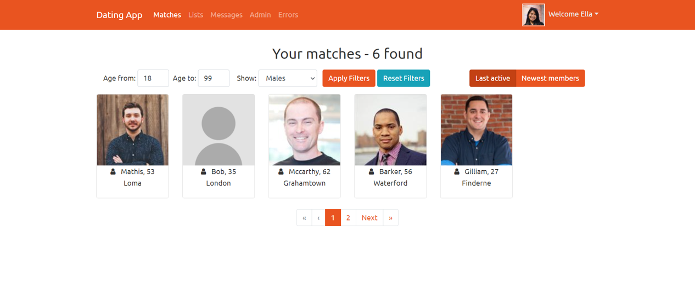
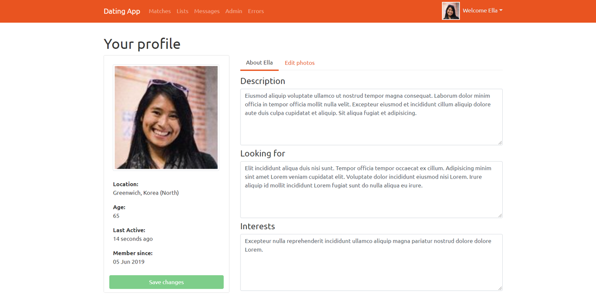

# DatingApp

A dating application created using Angular framework and ASP.NET Core. Based on a Udemy course (https://www.udemy.com/course/build-an-app-with-aspnet-core-and-angular-from-scratch/).
Includes features such as authentication, authorisation, basic CRUD operations, Cloudinary activites, etc.

This project was generated with [Angular CLI](https://github.com/angular/angular-cli) version 8.3.20.

## What you'll need to start the app

First of all, make sure you have Node JS installed.

Copy the repo link and clone it on your device by running `git clone [link]`.

After that, navigate to the client directory in your terminal and run `npm install`.

### Additional setup

#### SSL

If you wish to send HTTPS request you will need to generate an SSL certificate. To do that you may use [openssl](https://www.openssl.org/).
The options in the app are set to expect a folder names `ssl` inside the client directory, in which you'll need to put your key and the certificate.

There is also the option of falling back to HTTP by commenting out the line `app.UseHttpsRedirection()` inside the `Configure` method of your `Startup.cs` file.
Also, you will need to modify the `launchSettings.json` on the 'applicationUrl' property and change https into http.
In the `environment.ts` change the apiUrl property in the same way.

#### Cloudinary

The client side of the app works with Cloudinary. To successfully interact with the app, you will need to store your new (or existing) account's properties in the `appsettings.json`
file: 
`"CloudinarySettings": {
    "CloudName": "...",
    "ApiKey": "...",
    "ApiSecret": "..."
  },`

## Running the app

In the API folder run the following command: `dotnet watch run`. After that navigate to `http://localhost:5001/`.

In the client folder of the app run `ng serve` for a dev server. Navigate to `http://localhost:4200/`. The app will automatically reload if you change any of the source files.

## Build

Run `ng build` to build the project. The build artifacts will be stored in the `dist/` directory. Use the `--prod` flag for a production build.

## Demo

## Further help

To get more help on the Angular CLI use `ng help` or go check out the [Angular CLI README](https://github.com/angular/angular-cli/blob/master/README.md).
